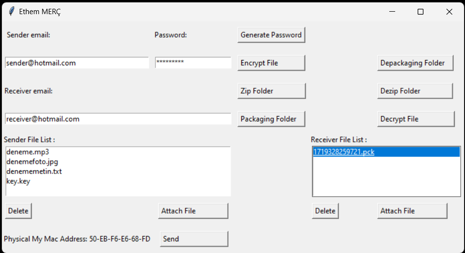

# Secure_E-Mailing_Application
This project created for forth semestre student project!

How to use ?
1. Copy to folder in desktop
2. Generate a password
3. Attach Files for encryption
4. Click to 1--> Zip Folder 2-->Packaging Folder
5. You can see your package at receiver file list screen
6. Enter sender e-mail, sender password and receiver e-mail address (USE HOTMAIL BECAUSE OF Third Part G-MAIL PROBLEMS )
7. If you a receiver copy your package on desktop
8. Click to 1--> Depackaging Folder 2-->Dezip Folder 3-->Decrypt File

  
 
</a>

ATTENTION: THIS PROJECT IS NOT FINISHED YET BECAUSE I TRY TO PHYSICAL ENCRYPTION METHOD

